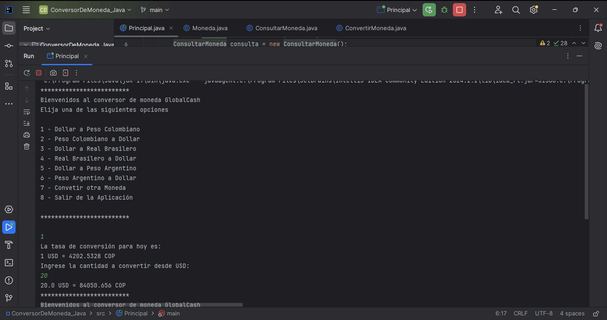

# Conversor de Moneda - GlobalCash

GlobalCash es un conversor de monedas simple que permite convertir entre distintas divisas de manera interactiva. El programa está basado en Java y utiliza una API externa para obtener 
las tasas de conversión en tiempo real entre el dólar estadounidense (USD) y monedas como el peso colombiano (COP), real brasileño (BRL) y peso argentino (ARS). Además, el usuario tiene 
la opción de realizar conversiones entre otras monedas que no están predefinidas en el menú.

## Funcionalidades

## Conversión predefinida de monedas:

- USD a COP (Peso Colombiano)
- COP a USD
- USD a BRL (Real Brasileño)
- BRL a USD
- USD a ARS (Peso Argentino)
- ARS a USD
- **Conversión personalizada entre otras monedas**: El usuario puede ingresar las divisas de origen y destino de su preferencia.

## Requisitos

Para ejecutar este programa necesitas:

- Java 11 o superior instalado.
- Conexión a internet (para acceder a la API de tasas de cambio).

## Instalación

1. Clona este repositorio o descarga los archivos del proyecto.
   ```bash
   git clone https://github.com/Edwinestrada07/ConversorDeMoneda_Java.git
   
2. Asegúrate de tener Java configurado en tu sistema.
    
3. En la línea de comandos, navega al directorio del proyecto y compila el programa:

   **javac Principal.java**

4. Ejecuta el programa:

   **java Principal**

5. En el menú interactivo, selecciona la opción deseada ingresando el número correspondiente y presionando "Enter".

## Menú de Opciones


  
## Consideraciones

- API Externa: El programa utiliza una API de conversión de monedas. Asegúrate de tener acceso a la API y haber configurado correctamente tu clave de API en el código antes de ejecutar el programa.
- Tasas de cambio: Las tasas de cambio se actualizan en tiempo real al consultar la API.
  
## Licencia

Este proyecto está bajo la Licencia MIT. Proyecto desarrollado en el programa ONE de Alura LATAM y Oracle. 
